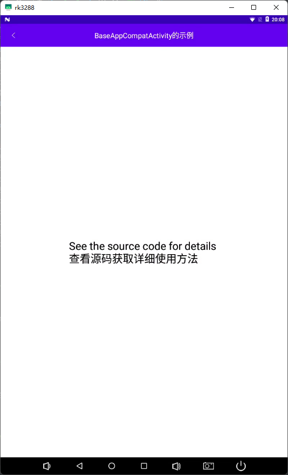

# BaseSample

BaseSample

当前最新版本：[](https://jitpack.io/#com.gitee.sscl/baselibrary-for-kotlin)

lasts version
now:[](https://jitpack.io/#com.gitee.sscl/baselibrary-for-kotlin)

由于网络原因，github总会不方便访问，此仓库的后续维护将在码云中继续

[传送门(quick link)](https://gitee.com/sscl/baselibrary-for-kotlin)

```xml
allprojects {
    repositories {
        ...
        maven {
             url 'https://jitpack.io'
       }  
    }
}
```

```xml
dependencies {
    //version is release tag
    implementation 'com.gitee.sscl:baselibrary-for-kotlin:version'
    //用到AutoSwipeRefreshLayout时需要引入swiperefreshlayout依赖库
    implementation 'androidx.swiperefreshlayout:swiperefreshlayout:1.1.0'
    //BaseSplashActivity需要引入SplashScreen库
    implementation 'androidx.core:core-splashscreen:1.0.0'}
```

用到BaseDataBindingAppCompatActivity时需要在主module的buid.gradle中开启dataBinding

```build
    android {
        ...
        //开启dataBinding
        dataBinding {
            enabled = true
        }
        ...
    }
```

使用DataBinding一般会同时使用ViewModel

```xml
     /* * * * * * * * * * * * * * * * * * * ViewModel库开始 * * * * * * * * * * * * * * * * * * */
    //ViewModel库基本
    implementation 'androidx.lifecycle:lifecycle-viewmodel-ktx:2.3.1'
    //ViewModel库高级
    implementation "androidx.activity:activity-ktx:1.3.1"
    /* * * * * * * * * * * * * * * * * * * ViewModel库结束 * * * * * * * * * * * * * * * * * * */
```

# 使用说明

## Activity

以下Activity基类均继承自 androidx.appcompat.app.AppCompatActivity

## BaseAppCompatActivity

封装Activity一些基本的使用流程，使用com.google.android.material.appbar.AppBarLayout +
androidx.appcompat.widget.Toolbar替代Activity默认的ActionBar 使用时需要注意在style文件中配置以下属性
具体使用方法请下载源码参考

```xml
<item name="windowActionBar">false</item>
<item name="windowNoTitle">true</item>
```



## BaseDataBindingAppCompatActivity

用法与 BaseAppCompatActivity
完全相同，但加入的关于databinding的特性，具体使用方法请下载源码参考，加上ViewModel与LiveData组合实现通过输入框的内容更改文本内容


## BaseDrawerActivity

基于google官方的DrawerLayout示例修改，可方便的集成使用DrawerLayout + NavigationView 用法与 BaseAppCompatActivity 完全相同


特殊的Activity

## BaseSplashActivity

闪屏界面，使用SplashScreen库实现，兼容性更好，使用前需要引入SplashScreen库，以及使用对应的基于SplashScreen的style，style示例如下

```xml
    <!--  使用SplashTheme主题  -->
<style name="AppSplashTheme" parent="SplashTheme">
    <!--    更改开屏界面的背景图片    -->
    <item name="android:windowBackground">@drawable/com_sscl_basesample_bg_splash</item>
</style>
```


# BasePurposeAdapter

万能适配器，继承自android.widget.BaseAdapter,可泛用于 ListView Spinner等控件

# BaseFragment

继承自androidx.fragment.app.Fragment，可方便的集成使用 用法与 BaseAppCompatActivity 完全相同，并加入和Activity一样的
findViewById方法

# BasePopupWindow

继承自 android.widget.PopupWindow，可更方便的集成使用

# BaseAutoBootReceiver

开机自动启动的广播接收器，可方便的集成使用

使用方法如下 1.新建一个广播接收器

```kotlin
class AutoBootReceiver : BaseAutoBootReceiver() {
    override fun doBootComplete(context: Context, receivedIntent: Intent) {
        val intent = Intent(context, SplashActivity::class.java)
        intent.addFlags(Intent.FLAG_ACTIVITY_NEW_TASK)
        context.startActivity(intent)
    }
}  
```

2.在AndroidManifest.xml中注册广播接收器

```xml

<manifest>
    <application>
        .....
        <receiver android:name=".AutoBootReceiver" android:exported="true">
            <intent-filter>
                <action android:name="android.intent.action.BOOT_COMPLETED" />
            </intent-filter>
        </receiver>
        .....
    </application>
</manifest>
```

# TextWatcher

常用的一些输入监听器，可方便的集成使用

## BluetoothAddressTextWatch

蓝牙地址/MAC地址输入监听器，可方便的集成使用

## HexTextAutoAddCharInputWatcher

十六进制输入监听器，可方便的集成使用

## HexTextAutoAddEmptyCharInputWatcher

十六进制(会自动加入空格)输入监听器，可方便的集成使用

## Ip4AddressTextWatcher

IPv4地址输入监听器，可方便的集成使用

# 工具类

## FileUtil

文件工具类，提供基本的文件目录管理，内部目录与存储目录（仅限于使用当前程序的目录，其他程序的目录使用此工具类不可用）

在Application中初始化即可

```kotlin
    class MyApplication : Application() {
    override fun onCreate() {
        super.onCreate()
        FileUtil.init(this)
    }
}
```

## ApkController

可对安装包进行一些基本操作

```kotlin
    // 安装apk，会根据是否有root权限进行静默安装或者普通安装
ApkController.install()
// 卸载apk,会根据是否有root权限进行静默卸载或者普通卸载
ApkController.uninstall()

```

## BaseManager

基本类，提供基本的管理功能，如下：

```kotlin
    //全局唯一Handler
    BaseManager.handler
    //全局唯一threadFactory
    BaseManager.threadFactory
    //新建一个threadFactory
    BaseManager.newThreadFactory()
    //新建一个定时任务执行器（定时器不推荐使用，这是可以替代定时器的类）
    BaseManager.newScheduledExecutorService()
```

## BigDecimalUtils

大数计算（精确计算）工具类

## ConversionUtil

数据转换工具类，包含多种数据转换方法

```kotlin
    //字符串转换成十六进制字符串(字符串转ASCII码)
    ConversionUtil.strToHexStr()
    //将IP v4的字符串转为byte数组
    ConversionUtil.ipv4StringToByteArray()
    //字符串转换成byte数组
    ConversionUtil.getByteArray()
    //符串转换成byte数组，自动判断中文简体语言环境，在中文简体下，自动以GBK方式转换（数组长度最长为byteArrayLength）
    ConversionUtil.getByteArrayAutoGbk()
    //十六进制转换字符串（ASCII码字符串转为可读字符串）
    ConversionUtil.hexStrToStr()
    //byteArray转换成十六进制字符串，Byte值之间空格分隔
    ConversionUtil.byteArrayToHexStr()
    //将长整形转为byte数组
    ConversionUtil.longToByteArray()
    //将long类型数（0~0x0000FFFFFFFFFFFF之间）转为6字节byte数组
    ConversionUtil.longToByteArrayLength6()
    //将 long 类型数转为指定长度的 byte 数组
    ConversionUtil.longToByteArray()
    //十六进制字符串转换为Byte数组（十六进制字符串之间没有分隔符）
    ConversionUtil.hexStrToByteArray()
    //byte数组转为long
    ConversionUtil.byteArrayToLong()
    //String的字符串转换成unicode的String
    ConversionUtil.strToUnicode()
    //unicode的String转换成String的字符串
    ConversionUtil.unicodeToString()
    //将一个byte数组拼接为一个int型数
    ConversionUtil.byteArrayToInt()
    //格式化数字为千分位显示
    ConversionUtil.formatMicrometer()
    //将一个整数转换成2个字节的byte数组
    ConversionUtil.intToByteArrayLength2()
    //将一个整数转换成4个字节的byte数组
    ConversionUtil.intToByteArrayLength4()
    //将整数转换成16进制字符串
    ConversionUtil.intToHexStr()
    //将字节型数据转换为0~255(无符号数)
    ConversionUtil.getUnsignedByte()
    //将字节型数据转换为0~65535(无符号数)
    ConversionUtil.getUnsignedShort()
    //将带空格的十六进制字符串转为byte数组
    ConversionUtil.hexStringToByteArray()
    //将int数据转换为0~4294967295（无符号数）
    ConversionUtil.getUnsignedInt()
    //将int转为boolean(0 = false ,1 = true)
    ConversionUtil.intToBoolean()
    //将boolean转为int(true = 1,false = 0)
    ConversionUtil.booleanToInt()
    //将任意对象转为byte数组（Serializable接口或Parcelable接口的对象）
    ConversionUtil.objectToByteArray()
    //将数组类型转为指定的对象（Serializable接口或Parcelable接口的对象）
    ConversionUtil.byteArrayToObject()
    //将蓝牙MAC地址转为byte数组
    ConversionUtil.macAddressStringToByteArray()
    //将MAC地址数组转为设备地址字符串
    ConversionUtil.macAddressByteArrayToString()
    //将一个int型的Ip地址转为点分式地址字符串
    ConversionUtil.intIp4ToStringIp4()
    //将一个int型的Ip地址转为点分式地址字符串（逆序转换）
    ConversionUtil.intIp4ToReverseStringIp4()
```

## CrashHandler

未处理异常（未在try代码块中运行抛出的异常）捕获处理类

```kotlin
    //设置自定义的异常处理回调（上报异常信息或重启程序等）
    CrashHandler.getInstance().setOnExceptionListener()
    //初始化CrashHandler(调用此方法时一定要确保已经获取到了SD卡的权限，并且此工具类依赖于FileUtil工具类,请确保已经调用了FileUtil的init方法)
    CrashHandler.getInstance().init()
```

## DebugUtil

日志打印工具类，用于调试打印，可设置是否开启打印

```kotlin
    //开启日志打印
    DebugUtil.setDebugFlag(true)
    //设置打印TAG，默认为"BaseLibrary->"
    DebugUtil.setDefaultTAG()
    //info级别打印
    DebugUtil.infoOut()
    //error级别打印
    DebugUtil.errorOut()
    //warn级别打印
    DebugUtil.warnOut()
    //debug级别打印
    DebugUtil.debugOut()
    //verbose级别打印
    DebugUtil.verOut()
```

## DefaultItemDecoration

RecyclerView 的分割线，可快速使用

```kotlin
     recyclerView.addItemDecoration(DefaultItemDecoration.newLine(Color.GRAY))
```

## HomeWatcher

Home键的监听

```kotlin
override fun onCreate() {
    ...
    homeWatcher = HomeWatcher(this)
    homeWatcher.startWatch()
}

//千万不要忘记在onDestroy中调用stopWatch()方法
override fun onDestroy() {
    super.onDestroy()
    homeWatcher.stopWatch()
}
```

## LogCatHelper

日志缓存工具类。此工具会缓存程序运行中打印的日志（没有在打包时关闭日志输出才会有程序日志）

```kotlin
    //初始化(调用此方法时一定要确保已经获取到了SD卡的权限，并且此工具类依赖于FileUtil工具类,请确保已经调用了FileUtil的init方法)
    LogCatHelper.getInstance().init()
```

## PermissionUtil

权限请求工具类，用于android 6.0(API 23)以上的动态权限请求

```kotlin
//权限请求回调
private val onPermissionRequestResult: PermissionUtil.OnPermissionRequestResult =
    object : PermissionUtil.OnPermissionRequestResult {
        /**
         * 权限请求成功
         */
        override fun permissionRequestSucceed() {
            //TODO 权限请求成功
        }

        /**
         * 权限请求失败
         *
         * @param failedPermissions 请求失败的权限
         */
        override fun permissionRequestFailed(failedPermissions: Array<String>) {
            //判断是否有权限被永久拒绝
            val permissionAlwaysDenied: Boolean = PermissionUtil.isAnyPermissionAlwaysDenied(
                this@SplashActivity,
                *failedPermissions
            )
            if (permissionAlwaysDenied) {
                //有权限被永久拒绝，前往设置界面
                PermissionUtil.toSettingActivity(thisActivity)
                BaseManager.handler.postDelayed({
                    needCheckPermission = true
                }, 500)
            } else {
                //权限被拒绝的操作
            }
        }
    }

private var needCheckPermission = false

//在Activity的onResume中再次请求权限
override fun onResume() {
    super.onResume()
    if (needCheckPermission) {
        needCheckPermission = false
        checkPermissions()
    }
}
//验证是否有权限
PermissionUtil.hasPermissions(context, perms)
//设置权限请求回调
PermissionUtil.setOnPermissionRequestResult(onPermissionRequestResult)
//请求权限
PermissionUtil.requestPermissions(activity, perms, requestCode)

//在Activity的onRequestPermissionsResult加入请求结果传递
override fun onRequestPermissionsResult(
    requestCode: Int,
    permissions: Array<String>,
    grantResults: IntArray
) {
    super.onRequestPermissionsResult(requestCode, permissions, grantResults)
    PermissionUtil.onRequestPermissionsResult(this, requestCode, permissions, grantResults)
}

//完整使用流程请参考com.sscl.basesample.activities.SplashActivity
```

## SharedPreferencesTools

SharedPreferences工具类

```kotlin
val sp = SharedPreferencesTools.getInstance(this, "Test")
val testResult = sp.getValue("test", "")
```

## StatusBarUtil

状态栏工具类，用法就不必多说了，大家应该都会用

## SystemUtil

系统工具类

```kotlin
//是否为Flyme系统
SystemUtil.isFlyme()
//是否为EMUI
SystemUtil.isEmui()
//是否为MIUI
SystemUtil.isMiui()
//设置flyme状态栏深色图标
SystemUtil.flymeSetStatusBarLightMode()
//设置miui状态栏深色图标
SystemUtil.miuiSetStatusBarLightMode()
//判断是否有root权限
SystemUtil.hasRootPermission()
//启动指定程序
SystemUtil.startApp(packageName, activityName)
//文件复制到system/app 目录(复制到系统APP目录)
SystemUtil.copy2SystemApp()
//代码触发Home键
SystemUtil.pressHomeButton()
//隐藏系统键盘
SystemUtil.hideSoftInputMethod()
SystemUtil.hideSoftInput()
//开始监听屏幕状态
SystemUtil.startScreenStatusListener()
//设置监听屏幕状态的回调
SystemUtil.setOnScreenStatusChangedListener()
//停止监听屏幕状态
SystemUtil.stopScreenStatusListener()
//重启应用程序
SystemUtil.restartApplication()
//隐藏导航栏
SystemUtil.hideNavigationBar()
//设置软键状态
SystemUtil.setInputMethodState()
//退出程序
SystemUtil.exitProcess()
//获取默认的屏幕大小
SystemUtil.getDefaultScreenSize()
```

## ToastUtil

吐司工具类，可自定义时长与复用toast，可使用View进行Toast

```kotlin
//长时间的吐司
ToastUtil.toastLong()
//短时间的吐司
ToastUtil.toastShort()
//自定义时长的吐司 
ToastUtil.toast()
//立即取消吐司
ToastUtil.cancel()
```

## Tool

通用工具类

```kotlin
//检测byte数组中的内容有效性（全0为无效）
Tool.checkByteValid()
//显示或隐藏输入框中的字符（常用于登录界面的显示密码勾选框）
Tool.showEditTextPassword()
//检测系统环境是否是中文简体
Tool.isZhCn()
//设置输入框输入类型
Tool.setInpType()
//解除输入法的内存占用
Tool.releaseInputMethodManagerMemory()
//让当前线程阻塞一段时间
Tool.sleep()
//设置文本到剪切板
Tool.setDataToClipboard()
//从剪切板获取文本
Tool.getDataFromClipboard()
//获取异常的详细文本
Tool.getExceptionDetailsInfo()
//获取本机基本信息
Tool.getPhoneInfo()
//检查文本是否符合IPv4格式
Tool.checkIpv4String()
//获取RecyclerView第一个可见的选项位置
Tool.getFirstVisibleItemPosition()
//获取RecyclerView最后一个可见的选项位置
Tool.getLastVisibleItemPosition()
//获取RecyclerView最后一个完全可见的选项位置
Tool.getLastCompletelyVisibleItemPosition()
//转换DP值为象素值
Tool.dpToPx()
//获取主题Primary颜色
Tool.getColorPrimary()
//获取暗色主题Primary颜色
Tool.getDarkColorPrimary()
//获取暗色主题PrimaryVariant颜色
Tool.getDarkColorPrimaryVariant()
//获取主题Accent颜色
Tool.getColorAccent()
//获取主题状态栏颜色
Tool.getStatusBarColor()
```

## TTsUtils

TTS语音工具类，仅使用支持中文的TTS

```kotlin
//初始化
TTsUtils.init(context,object : TTsUtils.OnInitListener{
    /**
     * 初始化成功
     */
    override fun initSucceed() {
       
    }

    /**
     * 初始化失败
     */
    override fun initFailed() {
       
    }
})
TTsUtils.speak(text,false)
```

## UsbUtil

USB工具类

```kotlin
//开始监听USB
USBUtil.startUsbListener()
//停止监听USB
USBUtil.stopUsbListener()
//设置USB的监听
USBUtil.setOnUSBListener()
//判断USB设备类型
USBUtil.checkDeviceClass()
//获取U盘文件路径
USBUtil.getUDiskPath()
```

## ZipUtils

zip文件解压工具类

# 自定义View

自定义View有很多，请下载源码（或阅读原码）获取使用方法

## banner

## ArcProgressBar

## AutoScrollTextView

## AutoSwipeRefreshLayout

## CirclePointView

## CircleProgressBar

## FlowLayout

## GifView

## LollipopFixedWebView

## NumberInputMethodView

## PasswordView

## ReSpinner
